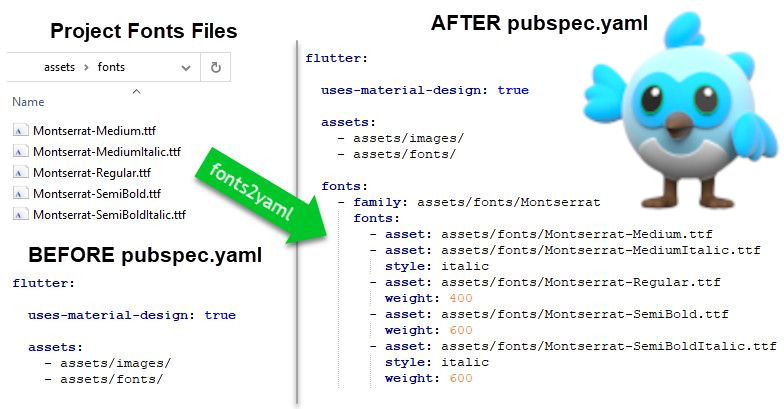
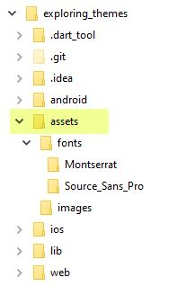
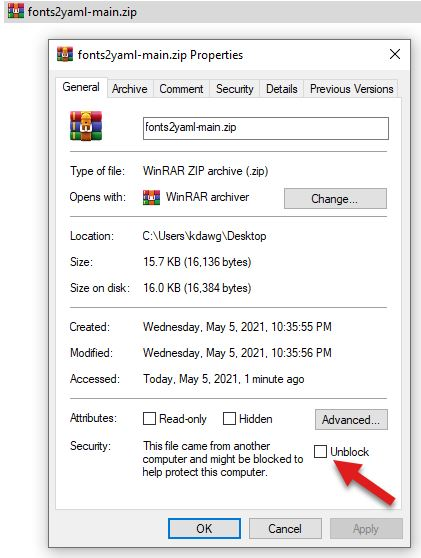
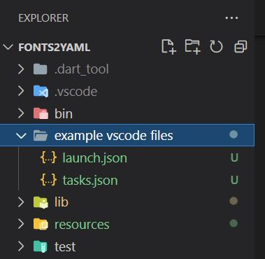
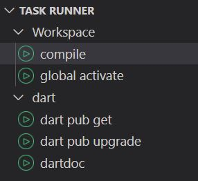

# Fonts2YAML



The <a href="https://flutter.dev/docs/cookbook/design/fonts" target="_blank">Flutter use a custom font</a> doc page describes how to add fonts to your Flutter projects.  This involves hand editing the project `pubspec.yaml` file. 

This tool greatly simplifies this task by discovering font files in your project and updating the `fonts:` section in the `pubspec.yaml` file. 

Please share your thoughts on this tool in the <a href="https://github.com/longtimedeveloper/fonts2yaml/discussions" target="_blank">Fonts2YAML DIscussions</a> tab, thank you.

## Status

- Feature Complete
- Unit and integration tests - IN PROGRESS

## Background

I started serious Dart and Flutter programming in April 2021. As my custom, if I find myself doing repetitive tasks, I stop and write a tool to handle them for me.

When a font file is added or removed from a Flutter application, the pubspec.yaml file needs to be updated to reflect the addition or removal of the font file. After doing this twice, I stopped and wrote this tool so I would never have to do this again.

I hope you enjoy the productivity boost from this tool in your Flutter development.

## Videos

- <a href="https://www.youtube.com/playlist?list=PLs9tmBOnV5sK0rBjCEyZI0Y1SogfPOaMF" target="_blank">Fonts2YAML YouTube Playlist</a>
- <a href="https://www.youtube.com/watch?v=ah06rY-sYzs" target="_blank">50 second infomercial</a>
-  <a href="https://www.youtube.com/watch?v=a9cSo0OiGuA" target="_blank">10 minute installation for Windows</a> (recommended for most Windows developers.)
- 2 minute installation for macOS (recommended for most macOS developers.)
- 2 minute usage video (recommended for most developers.)
- (planned)30 minute deep-dive on writing this tool that covers the code and architecture.
- (planned)30 minute deep-dive on unit and integration tests for this tool.

## Tool Usage

To view the tool usage, use the '-h' flag on the command-line `fonts2yaml -h`. 

```
D:\Code\flutters\apps\exploring_themes>fonts2yaml -h

Dart command-line tool that updates the fonts section in the Flutter pubspec.yaml.

Usage: fonts2yaml [<top-level font folders>] [<flags>]

Top-level font folders:   One or more top-level or root folders where fonts files are.
                          If not supplied, defaults to assets.
                          If supplied, values will be merged with any config file values.

                          Important: do not specify any sub-folder names.

Flags:
-h, --help                Print this usage information.
-c, --createEmptyConfig   Creates a default fonts2yaml.json file, does not update pubspec.yaml.
-t, --trialRun            Runs and writes font entries to console instead of pubspec.yaml.

Font Extensions:
    By default, the tool looks for .ttf, and .oft font files.
    Additional font extensions can be added to the config file.

Config file:
    Using a config file simplifies running fonts2yaml as no command line args are required.
    Using config file ensures the same results across team developers.

```

### Top-level font folders

The Top-level assets folder is highlighted below. For this project, I'm storing the fonts and images in the assets folder. Each font is in a sub-folder with the font family as the name. Naming sub-folders is not required, I do it for organization.

You can structure your projects any way you want.  The only requirement is to tell the tool which top-level folders to search through.  You can have multiple top-level folders if desired.

If you do not specify any folders the tool defaults to using the `assets` folder.



### Support Font Files

The tool is programmed to support fonts downloaded from <a href="https://fonts.google.com/" target="_blank">Google Fonts</a>. The downloaded files all have a very specific naming convention that this tool understands. These below fonts are from Google Fonts. The naming convention fontfamily-weightstyle.extension where the style is optional.  Fonts downloaded from other sources may not follow this naming convention and would not work as expected. If you run into a problem with a font name, please post the issue in the discussion tab and I'll look into possibly supporting it.

        Montserrat-BoldItalic.ttf
        SpaceMono-Bold.ttf

### Config file

If your project uses one or more top-level font folders besides the `assets` folder, having to type these folder names on the command line would quickly become tedious. The config file allows for configuring the tool usage. Additionally, when working on a team, using the config file ensures all team members are using the same configuration.

If you would like to use the config file, use the option flag `-c` or `--createEmptyConfig` to create an empty `fonts2yaml.json` config file.  

        fonts2yaml -c

If you already have a config file and run `fonts2yaml-c`, you'll get warning that the tool will not overwrite your config file. If desired you can always delete the current config file and recreate an empty one by running the above command.

Once created, you can edit the `fonts2yaml.json` config file. See default file contents below.

`topLevelFontPaths` is an array of top-level folders.

`fontFileExtensions` is an array of font file extensions to create entries for. 

According to the <a href="https://flutter.dev/docs/cookbook/design/fonts" target="_blank">Flutter use a custom font</a> doc page, .ttf, and .oft are fully supported. The .woff, and .woff2 files are not supported on all platforms, which is why I don't include them in the default font file extensions, but you can add them to the config file if required. 

```
{
  "topLevelFontPaths": [
    "assets"
  ],
  "fontFileExtensions": [
    ".ttf",
    ".oft"
  ]
}
```

> **Note:** when the tool executes, it merges the folder names in the config file with any on the command line.

## Installation

Clone or download this repository.  

> **Windows Developers:**  If you are downloading the repo, after the file is downloaded (before you unzip it), right click on the downloaded file and click Unblock.  This removes the mark-of-the-web from the file. *NOTE: You should do this for every file you download from the Internet before using or unzipping it.*
> 
> 
> 

Open the project in your editor of choice.  Open a terminal window in your editor IDE or open the terminal window using your operating system commands for opening a terminal.

Ensure the your IDE runs `dart pub get` (VS Code does this automatically), if not, you must run this yourself to update the dependencies.

This is a Dart command-line console application. This tool is designed to be run within the Flutter application folder you need font files added to the `pubspec.yaml` file.

To do this, we first need to either compile and deploy the .exe, or add this tool to your dart local cache.

### Setup

There are two options for enabling you to execute this tool from the command-line.

1. Compile the tool and place the `.exe` file in a folder that is in your environment path.

2. Use the `dart pub global activate` command to run the tool from your local cache.

#### Compiling the tool

To compile the tool on your system run the below command.  You will have to modify the '-o' option to point to a folder on your system *that is in your path*.  I use `d:\dart` for my command line tools and utility batch files.

        dart compile exe bin/fonts2yaml.dart -o d:\dart\fonts2yaml.exe

On my system when I compile with the above command I get the following results.

```
D:\Code\flutters\fonts2yaml>dart compile exe bin/fonts2yaml.dart -o d:\dart\fonts2yaml.exe
Info: Compiling with sound null safety
Generated: d:\dart\fonts2yaml.exe
```

You can now execute `fonts2yaml` from any terminal on you system, *provided you have updated your path* to include the folder you outputted to.

> **NOTE:** if you have open terminal windows or an open IDE and your modify your path, you much close and reopen them to refresh you path environment variable.

> **Pro Tip:** Add a VSCode task that executes the compile command. I've provided two .json files in the `example vscode files` folder.  The sample task.json file can be copied  to your .vscode folder and then modified to meet you needs. 
>
>I also use <a href="https://marketplace.visualstudio.com/items?itemName=forbeslindesay.forbeslindesay-taskrunner#review-details" target="_blank">Task Runner</a> to easily discover and run my tasks.
>
> 
> 

#### Use dart pub global activate

This process has been documented by the Dart Team here <a href="https://dart.dev/tools/pub/cmd/pub-global" target="_blank">dart pub global docs page.</a>

Full command text.

        dart pub global activate --executable=fonts2yaml --source path . 

The above command will create the batch file `fonts2yaml.bat` in your local pub bin cache, see the below table for your system's location.

| Platform | Cache location |
|------------|--------------|
| macOS or Linux  | $HOME/.pub-cache/bin         |
| Windows*        | %LOCALAPPDATA%\Pub\Cache\bin |

&ast; The exact location of the system cache may vary for different versions of Windows.

Normally, you should be able to execute `fonts2yaml` from the command line to run this tool.

To use this option, you MUST add the above folder to your path.

Unfortunately, there is an open issue (as of May 2021) <a href="https://github.com/dart-lang/sdk/issues/42530" target="_blank">dart pub global activate, causes pub command not found error.</a>  Essentially, the generated batch file is not correct, preventing the command from executing.

To work around this issue you have two options.

1. Use the above compile option.

2. After running this command, edit the cache file by adding `dart` at the beginning of the last line.

> Before: pub global run fonts2yaml:fonts2yaml %*
>
> After:  **dart** pub global run fonts2yaml:fonts2yaml %*

#### Karl why didn't you publish the tool as a package in pub.dev?

Great question!

I want to see if the Flutter community is interested in this tool before spending a lot of time publishing a package. Let me know your thoughts in the <a href="https://github.com/longtimedeveloper/fonts2yaml/discussions" target="_blank">Fonts2YAML DIscussions</a> tab.

Actually, this tool is a candidate for the Flutter CLI.

## [License: MIT](LICENSE.md)